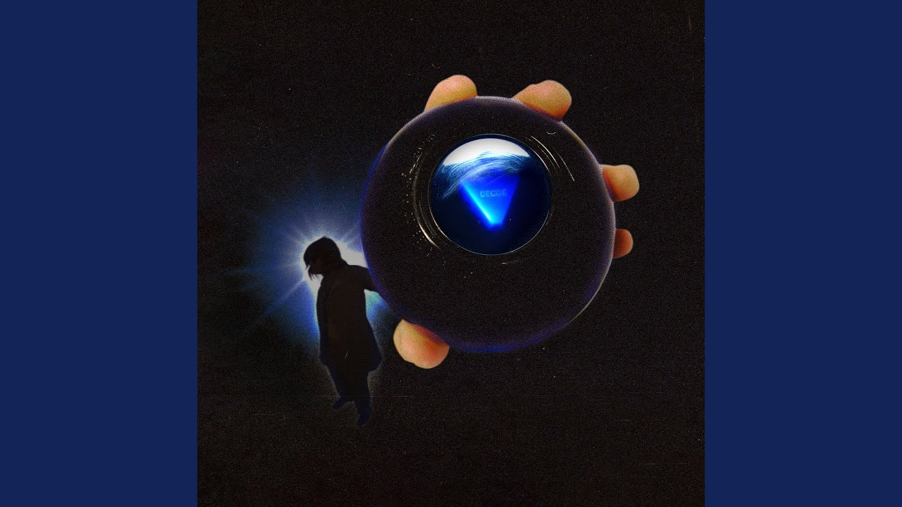
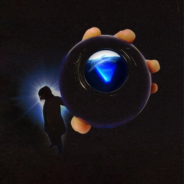

# image-proxy

**A simple and lightweight Image Proxy service.**

## Description

A simple and lightweight image proxy service that can resize YouTube thumbnails and trim the margins of the original thumbnail.

## Features

- Resize YouTube thumbnails to 300x300 pixels.
- Automatically trim the margins of the original thumbnail.
- Automatically delete all images after 10 minutes.

## Usage

To use the image proxy service:

1. Upload the image to the `/upload` endpoint.
2. The service will automatically resize YouTube thumbnails and trim the margins of the original thumbnail.
3. Access the processed image using the returned URL.

### Before and After Results

#### Before:

#### After:

## Contributing

Contributions are welcome! Feel free to open a pull request or submit an issue if you encounter any problems or have suggestions for improvements.

## License

This project is licensed under the [ISC License](LICENSE).
